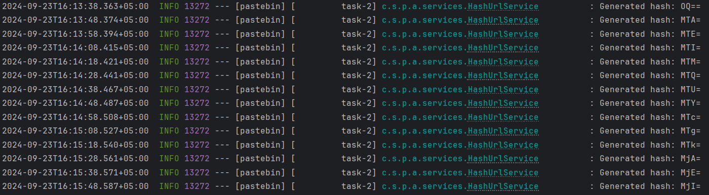
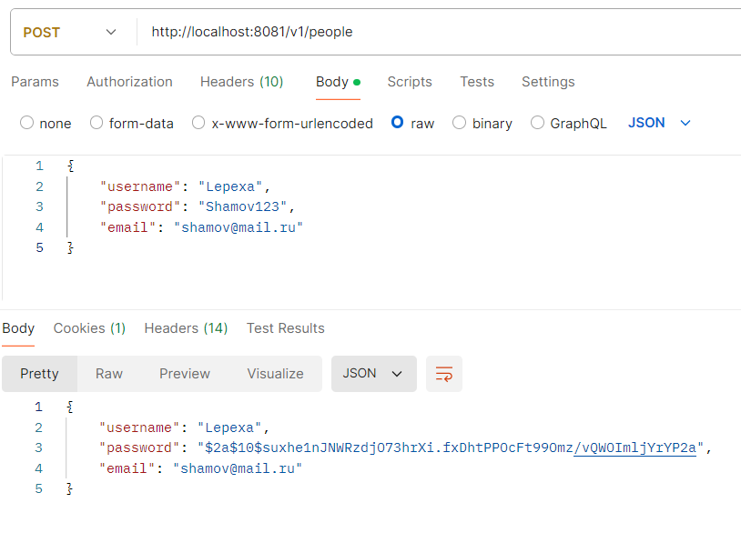
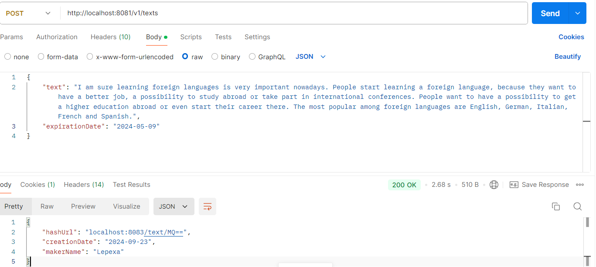
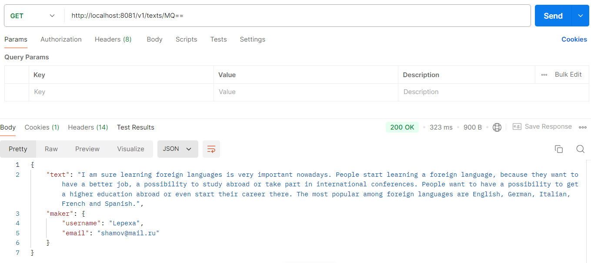
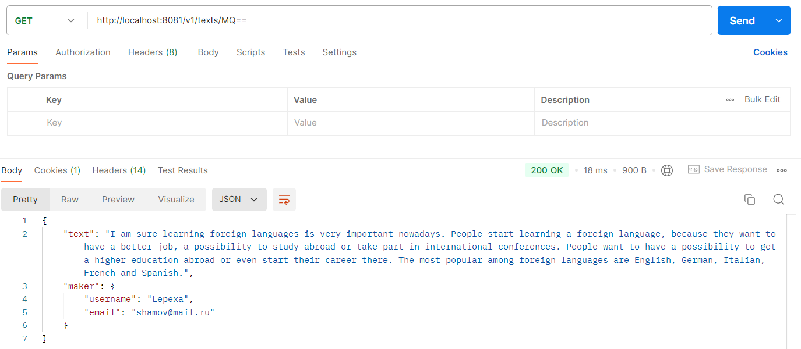

### Описание:
Сервис для размещения блоков текста с возможностью получения доступа по уникальной ссылке.
### Основные функции:
- **Микросервисная архитектура**: приложение разделено на два микросервиса — сервис для клиентов и сервис для хранения текста в облаке (S3). Это улучшает гибкость системы и ее отказоустойчивость.
- **Облачное хранилище (S3)**: текст сохраняется в Yandex Storage, а в базе данных хранятся только ссылки на файлы и метаданные. Такой подход снижает нагрузку на базу данных (уменьшение размера бэкапов, времени на их создание и восстановление).
- **Кэширование с Redis**: часто запрашиваемые данные (тексты и пользователи) кэшируются, что ускоряет доступ к ним.
- **Уникальные URL с предварительной генерацией**: хэши для текстов генерируются с помощью алгоритма Base64. Некоторое количество хэшей создается заранее, что позволяет быстро генерировать уникальные ссылки.
- **Автоматическое удаление текстов по истечении срока хранения**: пользователь может указать срок хранения текста. Ежедневно проверяются тексты, срок которых истек, и они удаляются как из хранилища, так и из базы данных.
### Технологии и инструменты:
- **Java** — основной язык программирования
- **Spring Boot** (Security, JPA) — фреймворк
- **Maven** — инструмент для сборки проекта
- **PostgreSQL** — база данных
- **Redis** — кэширование данных
- **S3 Yandex Storage** — облачное хранилище
- **Docker Compose** — развёртывание внешних сервисов

### Тестирование:
- **Postman** — для тестирования API

### Демонстрация:
- Генерация хэшей ([HashUrlService.java](pastebin%2Fsrc%2Fmain%2Fjava%2Fcom%2Fshtamov%2Fpastebin%2Fapplication%2Fservices%2FHashUrlService.java)) заранее на основе алогоритма base64:

- Регистрация пользователя:

- Загрузка текста:

- Получение текста:
  - Первое получение (223 мс):
  
  - Второе получение (18 мс):
  
